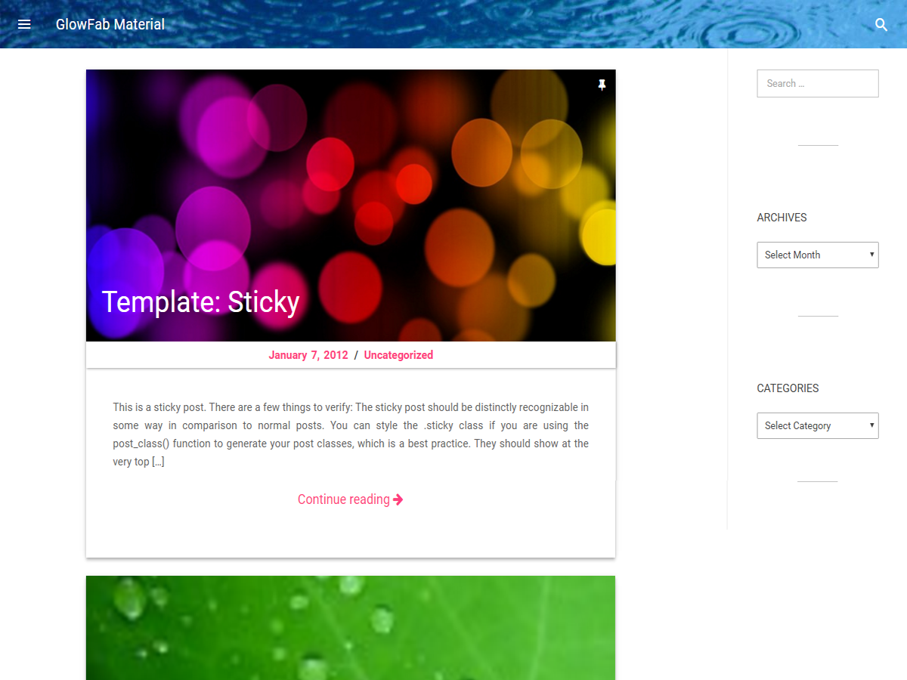

# GlowFab Material

GlowFab Material is a minimal WordPress theme based on Underscores (_s) and Material Design Lite, keeping the idea of being minimalist as much as possible, and also being fully responsive for all kinds of devices your site will be visited from.



## Customization

### Color Customization

GlowFab Material offers color customization for
- Header Background Color
- Header Text Color
- Background Color
- MSL Header Buttons Color

You can easily set your desired colors from customization menu or reset back to the default colors.

To access the customization menu you have to login to your WordPress site as admin.

### Header Image Customization

You can add, remove or disable header image in the customization menu's "Header Image" section.

The default size for header image is 1600x420 px (WxH).

### Sidebar/Widgets Position Customization

Sidebar positioning customization can be found in "Sidebar Position" section in Customizer. There are three options to place your sidebar for wider screen displays.
- No sidebar (which places the widgets area to the lower side of the main site contents)
- Left Sidebar
- Right Sidebar

To access the Customizer, you'll need to login your WordPress site as admin.

### Posts Default (fallback) Featured Image

Every post shows a featured image which is set for individual posts. But if any post doesn't have any featured image set by the author, a fallback featured image is show instead. This fallback featured image can be changed using this customization option.

### User Meta Customization

GlowFab Material has added some sections in Users profile to be shown in every blog post any user has made.

In WordPress admin, goto "**Users**" and click on edit of any existing users.

In the profile page there are several social media links and others boxes. Filling those informations accordingly will show the user info in user meta in every posts.

## License

This theme project is served under [GPLv2](http://www.gnu.org/licenses/gpl-2.0.html).

```
GlowFab Material, a simple mobile-first responsive WordPress theme.
Copyright (C) 2016-Present, Abu Md. Maruf Sarker

This program is free software; you can redistribute it and/or
modify it under the terms of the GNU General Public License
as published by the Free Software Foundation; under version 2
of the License.

This program is distributed in the hope that it will be useful,
but WITHOUT ANY WARRANTY; without even the implied warranty of
MERCHANTABILITY or FITNESS FOR A PARTICULAR PURPOSE.  See the
GNU General Public License for more details.

You should have received a copy of the GNU General Public License
along with this program, placed inside the project directory;
if not, write to the developer Abu Md. Maruf Sarker, contact
information can be found at https://marufsarker.github.io
```
